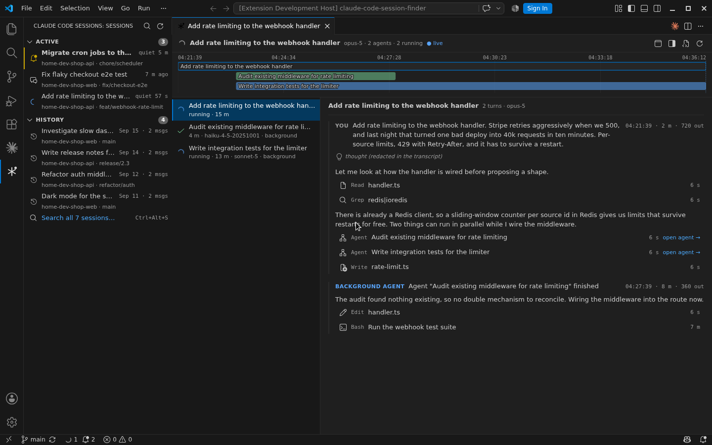

# Claude Code Sessions & Agents

See what every Claude Code session is doing, find any past conversation by what
was said in it, and read a session's full story — agents included — without
resuming it.

> Formerly **Claude Code Session Finder**. Same extension id, so an existing
> install updates in place; the commands, settings and keybinding are unchanged.
> Inside VS Code the view is simply **Claude Code Sessions**.

## What is a session?

Every conversation you have with [Claude Code](https://docs.anthropic.com/en/docs/claude-code) —
in the VS Code extension or the terminal — is a **session**. Claude Code writes
each one to disk as it goes, under `~/.claude/projects/`, as a transcript of
your prompts, Claude's replies, every tool call and its result, and one file
per **subagent** the session spawned. That is the complete record of the work,
and it outlives the chat window.

Claude Code shows you the session you have open. This extension shows you
**all of them**: which are still running, which are waiting on you, what
happened inside each, and how to get back to any of them.

## Three ways in

| Surface | Open it | For |
|---|---|---|
| **Sessions** view + status bar | the sessions icon in the activity bar | what is running or needs you right now, recent history, and a filter box that searches inside sessions while keeping the list browsable |
| **Search picker** | `Ctrl+Alt+S` (`Cmd+Alt+S` on macOS) or **Claude: Search Sessions** | the same search as a Quick Pick, when you know you want to jump to exactly one session |
| **Session View** | `V` on a row, the tree icon on a search result, or **Claude: Open Session View** | reading a session: agents, timeline, transcript |

Everything is read from the transcript files. Nothing is installed into Claude
Code, and nothing leaves your machine (see [Privacy](#privacy)).

## See what is running

The status bar shows `⟳ 2  🔔 3`: two sessions working, three waiting on you.
Hover for the list; click to search. The same glyphs mark rows in the Sessions
view and in search results:

| Glyph | State | Meaning |
|---|---|---|
| `⟳` spinning | running | the model is working — including long answers, which write nothing for a while |
| `?` | asks you | Claude asked a question (`AskUserQuestion`) and is waiting for the answer |
| `🔔` | needs you | waiting on a tool call for a while: usually a **permission prompt**, sometimes a slow tool |
| `💬` | done | Claude finished its turn and is waiting for you |
| `⊘` | interrupted | you stopped it (`Esc`); nothing is running until you type again |
| `⚠` | stalled | nothing written for 15+ minutes mid-turn; probably abandoned |

Hover a glyph for the sentence behind it. Rows are ordered by how much they need you: question, permission, done, interrupted, running, stalled.

State is derived from the last conversational record of each recently written
transcript, so a session in another window, another worktree, or a terminal
shows up too. Only sessions written within `sessionFinder.activeWindow`
(default 4 h) carry a state; `sessionFinder.toolQuietSeconds` (60) and
`sessionFinder.stalledMinutes` (15) tune the two thresholds.

## Browse sessions

The **Sessions** view lists what is live and what is history **for this
workspace**: sessions from its folders, their git repository and every worktree
of it. Sessions from other projects stay out until you press the filter button
in the view title (or `sessionFinder.sidebarScope`). The status bar and the
search picker always cover every project.

The row for the session in your active editor tab is highlighted, and follows
you as you switch between Claude Code tabs and Session Views.

- **Active** — sessions written in the last `activeWindow`, most urgent first:
  needs you, your turn, running, stalled. The time label says how long a
  session has been quiet.
- **History** — the 50 most recent finished sessions, with their project,
  branch and PR, and **Search all…** for everything older.

**Filter box.** Type at the top of the view (or press `/`) to search inside the
listed sessions with the same syntax as the picker below — words, `"phrase"`,
`pr:123`, `since:all`. Results replace the list and stay on screen: open one in
a tab, read another in the Session View, come back, refine, and `Esc` or the
`×` restores Active and History. Deep `!` searches stay in the picker.

`↑` `↓` move · `Enter` opens in a tab · `Shift+Enter` opens in the right panel ·
`V` opens the Session View · `T` opens the raw transcript · `/` filters. Hover
or focus a row for the same actions as buttons, plus a copyable deep link and
"reveal folder".

Opening in the right panel uses Claude Code's own "Open in Side Bar", which also
makes that the default for new sessions until you run **Claude Code: Open in New
Tab**; the first time, a notice says so.

## Search inside sessions

Claude Code's own picker matches session *titles*. Once a title stops reminding
you what happened, that session is lost. Search here — in the sidebar's filter
box or the `Ctrl+Alt+S` picker — matches what you and Claude actually **said**:

| Type | To find |
|---|---|
| `paste image` | sessions containing both words |
| `"paste image"` | that exact phrase |
| `pr:1234` | the session that opened that PR — exact, so the recency window is ignored |
| `since:30d`, `since:all` | narrow or widen the default 60-day window (`sessionFinder.defaultWindow`) |
| `!"npm run build"` | also search tool calls and results, including subagents — slower |

A `!` search matches whole transcripts, so quote a phrase unless you really do
want every session that mentions all those words anywhere.

| Row action | Behavior |
|---|---|
| `Enter` | opens the session — revealing an already-open tab, or opening a new one. A session from another git worktree opens in a window on that folder |
| 🌳 Session View | reads the session without resuming it |
| 🔗 Copy deep link | `vscode://anthropic.claude-code/open?session=<id>` |
| 📁 Reveal folder | reveals the session's folder in the explorer |
| 📄 Open transcript | the raw `.jsonl`, which works even for a session that can no longer be resumed |

## Read a session

The **Session View** opens a session in an editor tab straight from its
transcript — running, finished, or from a worktree that no longer exists — and
keeps up with the files while the session is active.

- **Agents** — the tree of everything the session spawned: agents, workflow
  runs grouped with their journals, agents spawned by agents, and denied
  spawns as dead ends. Select a node to read it.
- **Timeline** — one bar per agent from spawn to finish, packed into lanes so
  you can see what overlapped; an open bar is still running. Click a bar to
  read that agent.
- **Transcript** — turns: your prompt, Claude's reply, each tool call as a
  compact row that expands to its input and output, images from prompts
  inline, background-agent completions, and slash commands you ran. Thinking
  is marked, not shown; Claude Code stores it redacted.

"Raw transcript" in the header opens the underlying `.jsonl` for anything the
reader summarises. For a session you already have open, Claude Code's own
agents pill shows the same tree live; this view is for the ones you don't.

## Commands and settings

| Command | |
|---|---|
| **Claude: Search Sessions** | `Ctrl+Alt+S` / `Cmd+Alt+S` |
| **Claude: Show Sessions** | focus the Sessions view |
| **Claude: Filter Sessions** | focus the sidebar's filter box |
| **Claude: Sessions — Show All Projects** / **Show This Workspace Only** | toggle the sidebar's scope for this workspace |
| **Claude: Open Session View** | read the current or a chosen session |
| **Claude: Open Session in Tab** / **in Right Panel** | resume a session where you want it |
| **Claude: Refresh Sessions** | re-scan now |

| Setting | Default | |
|---|---|---|
| `sessionFinder.defaultWindow` | `60d` | recency window for searches; `pr:` ignores it |
| `sessionFinder.sidebarScope` | `workspace` | `workspace`: this workspace's folders, repo and worktrees · `all`: every project. The view's filter button overrides it per workspace |
| `sessionFinder.activeWindow` | `4h` | sessions written within this are Active and carry a state |
| `sessionFinder.toolQuietSeconds` | `60` | waiting on a tool longer than this shows 🔔 |
| `sessionFinder.stalledMinutes` | `15` | silence longer than this mid-turn shows ⚠ |

## Privacy

This extension reads your Claude Code transcripts from `~/.claude/projects`,
extracts the conversational text, and stores an index in VS Code's local
extension storage on your machine. **Nothing is uploaded, transmitted, or shared
with anyone, including the author.** There is no telemetry, no network access,
and no analytics of any kind.

## Requirements

The official [Claude Code extension](https://marketplace.visualstudio.com/items?itemName=anthropic.claude-code),
installed automatically as a dependency.

## Why it activates at startup

`activationEvents` is `["onStartupFinished"]` on purpose — **do not change it to `[]`.**
When you open a session that belongs to a different folder, this extension writes a
single-use hand-off file and asks VS Code to open that folder. The window that ends up
on the target folder has to notice that file, and a lazily-activated extension in a
window nobody has invoked a command in never would. Startup activation is what makes the
hand-off arrive. It is also what lets the status bar show live state before you ask.

## License

MIT
